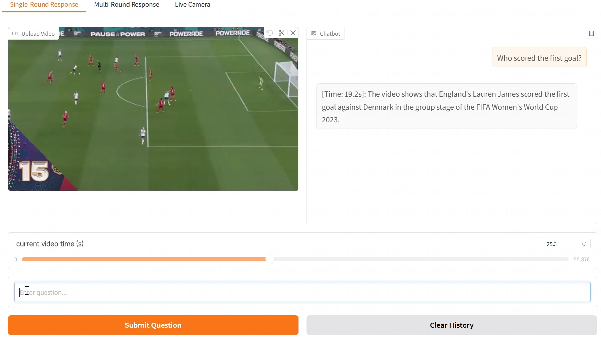

# Video-QA Web Demo

## Recorded Demo

### Single-round response
Upload a video, seek to any timestamp, and ask questions about the video you have seen so far.
<video controls>
    <source src="assets/camera.mp4" type="video/mp4">
    您的浏览器不支持视频标签。
</video>
[Watch the video](https://yaolinli.github.io/TimeChat-Online/demo/assets/camera.mp4)
### Multi-round response
Upload a video, seek to any timestamp, and ask questions about the video you have seen so far. The model will actively respond at certain key moments.
[Watch the video](https://yaolinli.github.io/TimeChat-Online/demo/assets/multi_round.mp4)
### Live Camera response
Use your local webcam for real-time video Q&A.
[Watch the video](https://yaolinli.github.io/TimeChat-Online/demo/assets/camera.mp4)


## Requirements
Make sure you have **Python 3.8+** installed for compatibility with the following dependencies.
```bash
pip install -r requirements_demo.txt
```
If your system does not have **ffmpeg**, you may need to install it manually:
```bash
sudo apt install ffmpeg
```
We recommend that you also install **flash_attn_2**.
```bash
pip install flash-attn --no-build-isolation
```

## Usage

Run the web demo script with optional parameters:
```bash
python web_demo.py [options]
```

### Options
| Option                   | Description                       | Default                   |
|--------------------------|-----------------------------------|---------------------------|
| `-c`, `--checkpoint-path`| Path to the model checkpoint      | `Qwen2.5-VL-7B-Instruct`*  |
| `--cpu-only`             | Run on CPU only                   | `False`                   |
| `--flash-attn2`          | Enable FlashAttention v2          | `True`                    |
| `--share`                | Enable sharing via public link    | `False`                   |
| `--inbrowser`            | Open UI in default web browser    | `False`                   |
| `--server-port`          | Port number for the server        | `7890`                    |
| `--server-name`          | Hostname/IP for the server        | `127.0.0.1`               |
| `--ui-language`          | UI language (`en` or `zh`)        | `zh`                      |

*For a better experience, we recommend that you change the default model path to our released checkpoint [`wyccccc/TimeChatOnline-7B`](https://huggingface.co/wyccccc/TimeChatOnline-7B).

## Demo workflow

Navigate to http://\<server-name\>:\<server-port\>.
- **Upload Local Video:** 
    1. Switch to "Upload Local Video" tab.
    2. Upload and play videos.
    3. Drag the time slider(or wait for automatic updates).
    4. Type a question and click Submit Question.

- **Live Camera:** 
    1. Switch to "Live Camera" tab.
    2. Click Submit Video to capture webcam frames.
    3. Type a question and click Submit Question.